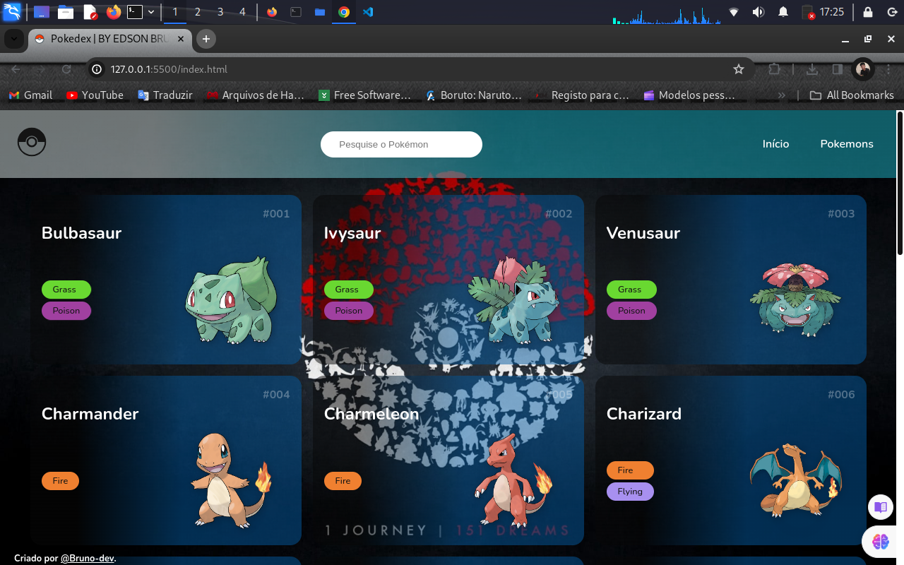
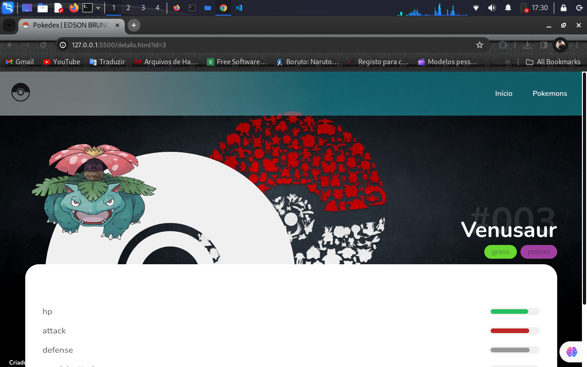
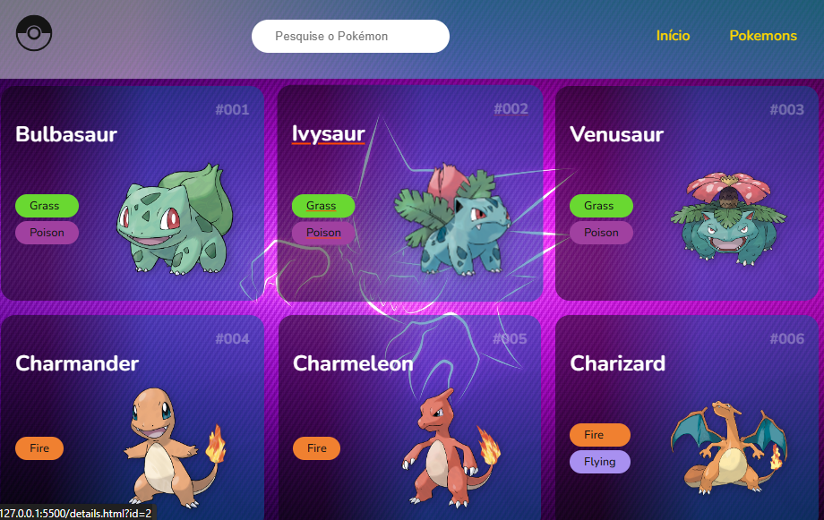
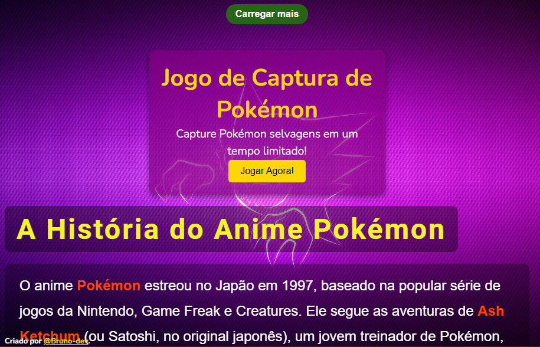

 <h1>Pokedex - Projeto de Lista de Pokémons</h1>

   
Este é um projeto simples de Pokedex (lista de Pokémons) desenvolvido por Edson Bruno. O projeto utiliza HTML, CSS e JavaScript para criar uma interface básica que exibe uma lista de Pokémons e permite carregar mais itens dinamicamente.

  <h2>Estrutura do Projeto</h2>
 <ul>
  <li><strong>index.html:</strong> Arquivo principal HTML que define a estrutura da página.</li>
  <li><strong>assets/:</strong> Pasta que contém recursos como imagens, estilos CSS e scripts JavaScript.</li>
  <ul>
  <li><strong>imgs/:</strong> Contém imagens utilizadas no projeto, como o ícone da Pokébola e outras.</li>
  <li><strong>css/:</strong> Contém o arquivo de estilo principal <code>styles.min.css</code>.</li>
  <li><strong>js/:</strong> Contém os scripts JavaScript necessários para interação com a API Pokémon e manipulação do DOM.</li>
  </ul>
 </ul>

 <h2>Estilos</h2>

  
O arquivo <code>styles.min.css</code> define estilos gerais para a página. Ele inclui um reset de estilos básico, configurações para a barra de rolagem e estilos para a estrutura da página.

  <h2>Funcionalidades</h2>
   <ul>
   <li>Exibição de uma lista de Pokémons.</li>
   <li>Botão "Carregar mais" para carregar mais itens à medida que o usuário rola a página.</li>
   <li>Barra de pesquisa para pesquisar Pokémons.</li>
   </ul>

  <h2>Fontes Externas</h2>

  
O projeto utiliza a fonte Nunito do Google Fonts para estilizar o texto.

   <h2>Autor</h2>

  
Este projeto foi criado por Edson Bruno.

   
    
   

   <h2>Projeto</h2>

  <ol>
  <li>Clone o repositório em sua máquina local.</li>
  <li>Abra o arquivo <code>index.html</code> em um navegador web.</li>
 </ol>
 
 <h2> 🚀 Atualização - Versão 1.1.0 🌟</h2>

Principais Destaques:

    Intensidade de Animações Aumentada:
        As animações agora apresentam uma intensidade aprimorada, proporcionando uma experiência mais envolvente.

    Degradê Transparente no Plano de Fundo:
        Adicionada uma nova classe para criar um degradê transparente, oferecendo um visual mais moderno e elegante.

    Imagem de Fundo Fixada com Distância do Topo:
        A imagem de fundo agora está fixada no plano de fundo, com uma distância de 20px do topo para uma apresentação mais sofisticada.

    Bootstrap Simplificado:
        O uso do Bootstrap foi simplificado para garantir uma estilização rápida e eficiente.

    Compatibilidade com Telas Pequenas Aprimorada:
        As animações foram otimizadas para uma melhor experiência em telas menores, mantendo a fluidez e a estética.

  <h1>Atualização do Projeto Pokedex v2.0.0</h1>

   <h2>Visão Geral</h2>
    

        Esta atualização do projeto Pokedex inclui a adição de uma nova seção de jogo interativo chamada "Captura de Pokémon". A seção foi desenvolvida para proporcionar aos usuários uma experiência de jogo divertida e envolvente, permitindo que eles capturem Pokémon selvagens em um ambiente virtual.
    

   <h2>O que há de novo</h2>

   <h3>Seção de Jogo</h3>
    <ul>
        <li><strong>Título do Jogo</strong>: Captura de Pokémon</li>
        <li><strong>Descrição</strong>: Os usuários podem capturar Pokémon selvagens em um tempo limitado.</li>
        <li><strong>Botão de Jogo</strong>: Um botão que, ao ser clicado, abre o jogo em uma nova aba do navegador.</li>
    </ul>

   <h3>Como Funciona</h3>
    <ol>
        <li><strong>Interface do Jogo</strong>: A nova seção é exibida na página principal da Pokedex, com um título e uma descrição do jogo.</li>
        <li><strong>Interação do Usuário</strong>: Os usuários podem clicar no botão "Jogar Agora!" para abrir o jogo em uma nova aba, proporcionando uma experiência fluida.</li>
        <li><strong>Simulação de API</strong>: A seção utiliza uma API fictícia para fornecer informações sobre o jogo, que pode ser facilmente expandida ou substituída por uma API real no futuro.</li>
    </ol>

   <h2>Estrutura do Código</h2>
    
A seção do jogo foi implementada usando HTML, CSS e JavaScript:

   <h3>HTML</h3>
    <pre><code>&lt;section class="pokemon-game"&gt;
    &lt;h2&gt;Jogo de Captura de Pokémon&lt;/h2&gt;
    &lt;p id="gameDescription"&gt;Carregando informações do jogo...&lt;/p&gt;
    &lt;button id="playGameButton"&gt;Jogar Agora!&lt;/button&gt;
&lt;/section&gt;</code></pre>

   <h3>CSS</h3>
    <pre><code>.pokemon-game {
    background-color: rgba(128, 0, 128, 0.7);
    color: #FFFFFF;
    padding: 20px;
    border-radius: 10px;
    text-align: center;
    margin: 20px auto;
    max-width: 400px;
    box-shadow: 0 4px 10px rgba(0, 0, 0, 0.5);
}</code></pre>

   <h3>JavaScript</h3>
    <pre><code>const gameAPI = {
    title: 'Captura de Pokémon',
    description: 'Capture Pokémon selvagens em um tempo limitado!',
    url: 'https://example.com/captura'
};

function loadGame() {
    const gameDescription = document.getElementById('gameDescription');
    const playGameButton = document.getElementById('playGameButton');

   gameDescription.textContent = \`\${gameAPI.description}\`;
    playGameButton.addEventListener('click', () => {
        window.open(gameAPI.url, '_blank');
    });
}

loadGame();</code></pre>

   <h2>Instruções para Uso</h2>
    <ul>
        <li>Clone o repositório ou faça o download dos arquivos.</li>
        <li>Abra o arquivo HTML no seu navegador.</li>
        <li>Explore a seção de jogo e clique no botão para jogar.</li>
    </ul>

   <h2>Futuras Melhorias</h2>
   <ul>
        <li>Integração com uma API real para jogos de Pokémon.</li>
        <li>Adição de mais jogos para enriquecer a experiência do usuário.</li>
        <li>Melhorias na interface do usuário para um design mais atraente.</li>
    </ul>
    
     
    
     

 
Esse é um projeto simples destinado a fins educacionais e pode ser expandido com mais recursos e funcionalidades. Sinta-se à vontade para contribuir ou personalizar conforme suas necessidades.

